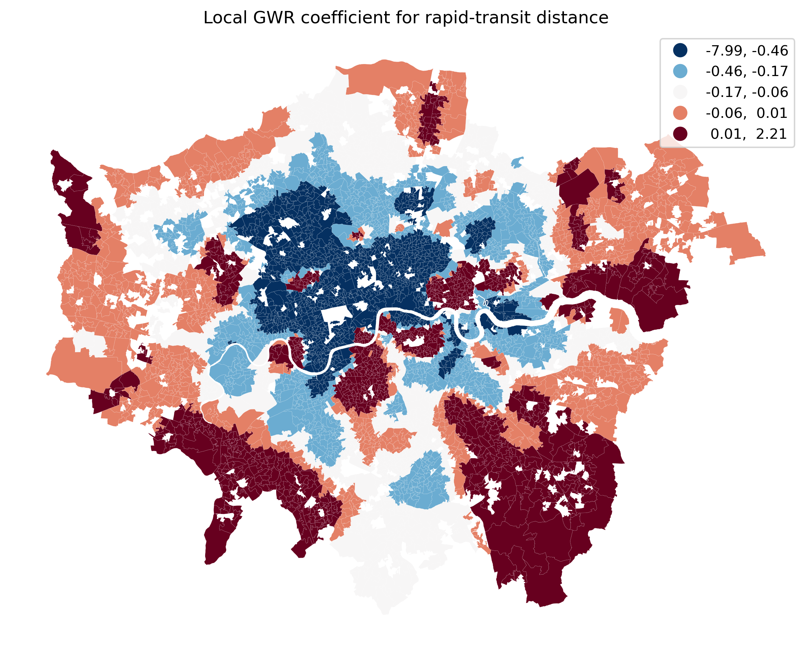

# Appendix for CW2 Report

*Spatial Variation in Airbnb Listing Counts across London*  
*Shui Zhou (K25120780), KCL Urban Informatics MSc*

## Appendix A. Code

Code and outputs are available in the public GitHub repository `Shui-Zhou/spatial-data-analysis-final` (https://github.com/Shui-Zhou/spatial-data-analysis-final).

Main analysis scripts:

- `Analysis/step1_eda_official_tfl.py`
- `Analysis/step2_ols_baseline.py`
- `Analysis/step3_spatial_autocorrelation.py`
- `Analysis/step4_gwr_models.py`
- `Analysis/step5_spatial_regression_robustness.py`

Environment:

- `mscui2026` conda environment
- Python 3.12 with `geopandas`, `mgwr`, `libpysal`, and `spreg`

## Appendix B. Robustness Checks

Spatial Lag and Spatial Error models (Step 5) confirm strong global spatial dependence (`rho = 0.715`, `lambda = 0.733`) but do not capture local variation. Post-GWR residual Moran's I falls sharply relative to OLS, dropping from `0.556` to `0.0668` in the raw-count GWR and `0.0777` in the log model, although some residual dependence remains. The log-transformed sensitivity model shows higher adjusted R² and fewer effective parameters, while the raw-count GWR leaves slightly less residual spatial autocorrelation. OSM-derived station features (`n = 307`) were also tested against the official TfL data (`n = 385`), with directionally consistent results across model specifications.

Appendix Figure 1 supplements the discussion in Section 3.5 by visualising the local coefficient surface for rapid-transit distance. More negative values indicate places where proximity to a station is associated with higher Airbnb counts, which is most evident in parts of north and west London.

**Appendix Figure 1.** Local GWR coefficient for rapid-transit distance in the raw-count model.

