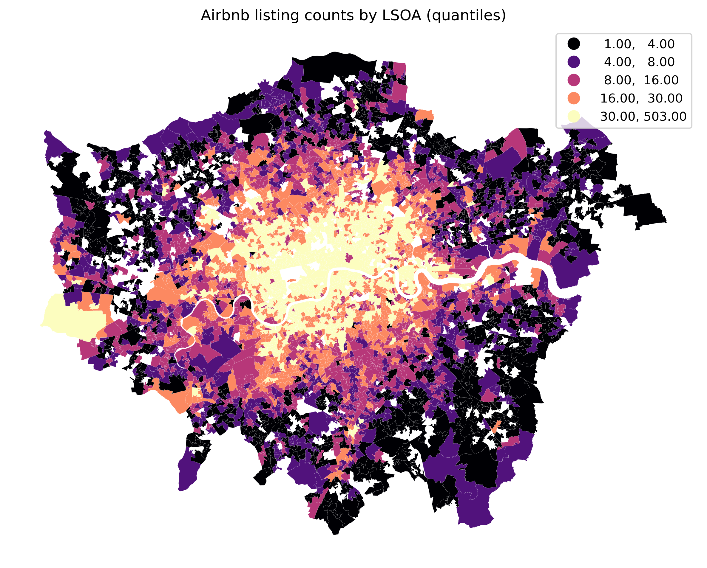
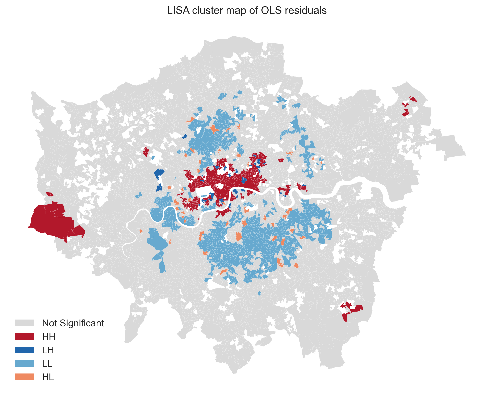
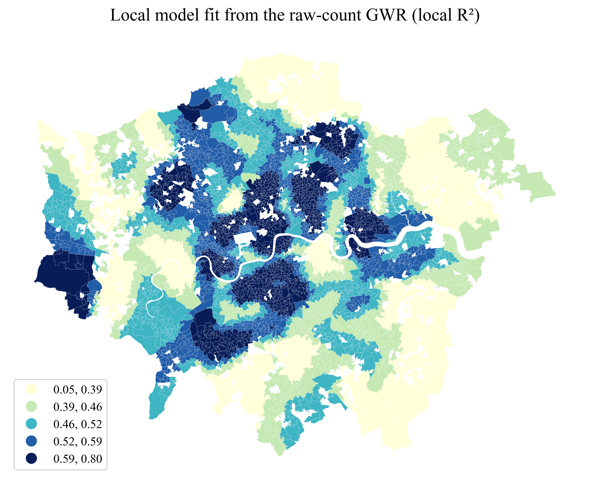
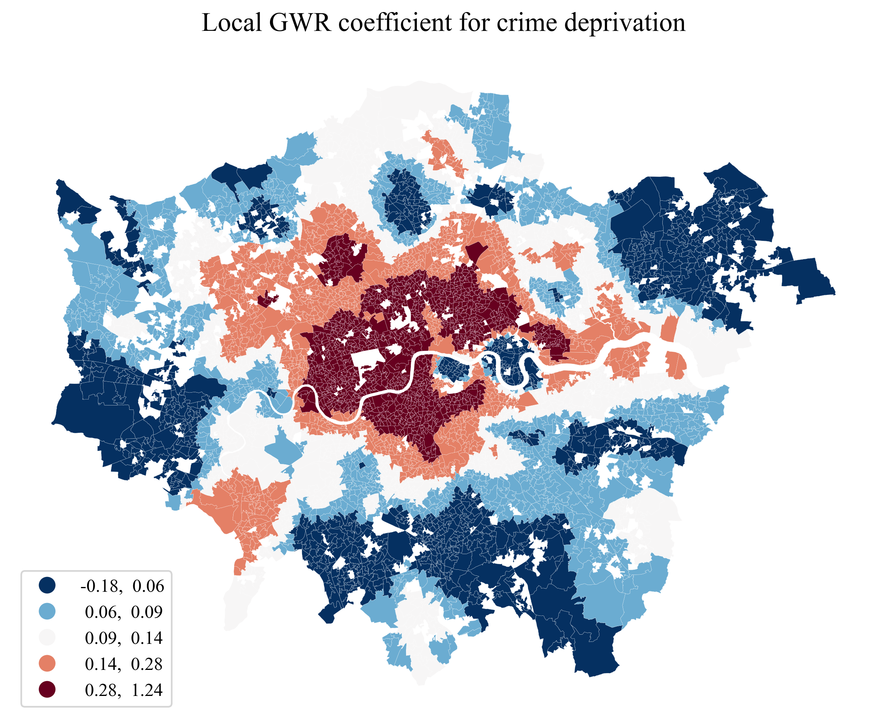

# Spatial Variation in Airbnb Listing Counts across London

*Explaining the roles of deprivation, house prices, centrality and rapid-transit access*  
*7CUSMSDA Spatial Data Analysis CW2 Report*  
*Shui Zhou (K25120780), KCL Urban Informatics MSc*

## 1. Context

The rapid growth of short-term rental platforms has reshaped urban housing markets. In London, listings are distributed unevenly, with pronounced clustering in inner boroughs while outer areas host far fewer properties (Shabrina et al., 2022). This uneven geography has attracted policy scrutiny, including London's 90-night annual limit on short-term lets (Greater London Authority, n.d.).

A growing literature links Airbnb to tourist amenities, transport connectivity, and night-time economies (Gutierrez et al., 2017; Quattrone et al., 2016). In London, Shabrina et al. (2022) showed that deprivation effects vary across space, implying that global coefficients can mask local dynamics. Yet fewer studies control simultaneously for house prices and accessibility, leaving open whether deprivation effects partly proxy for centrality and transport advantage.

This report extends that line of inquiry by integrating external accessibility data -- specifically, the distance from each neighbourhood to the nearest rapid-transit station, sourced from the Transport for London (TfL) Unified API -- alongside the Index of Multiple Deprivation (IMD) sub-domain scores and average house prices already available in the course dataset. The central research questions are:

1. To what extent do deprivation, house prices, centrality, and urban accessibility jointly predict Airbnb listing counts in the supplied London LSOA dataset?
2. Do the residuals of a global regression model exhibit significant spatial autocorrelation, indicating that a spatially explicit approach is warranted?
3. How do the relationships between these predictors and Airbnb listing counts vary across London's urban geography, and what urban mechanisms might explain that variation?

## 2. Data and Methods

### 2.1 Data

The primary dataset is a pre-compiled shapefile linking Airbnb listing counts, IMD 2019 sub-domain scores, and average house prices (`Value` in the original dataset) for 4,486 Greater London LSOAs in British National Grid (EPSG:27700). The dependent variable is the Airbnb listing-count field Prop_Count (median 12, range 1-503). The host-structure fields Small Host and Multiple Listing were excluded because they sum exactly to the dependent variable and would introduce target leakage.

Two spatial accessibility variables were added to reduce omitted-variable bias. First, Euclidean distance from each LSOA centroid to Charing Cross was calculated as a proxy for urban centrality. Second, nearest distance to a TfL rapid-transit station complex was derived from official StopPoint data covering Tube, DLR, Overground, and Elizabeth line services (385 station complexes after hub-level deduplication). This external dataset helps test whether deprivation effects are partly confounded by transport connectivity.

The final specification therefore combines Prop_Count as the dependent variable, average house price as a housing-market control, seven IMD 2019 sub-domain scores as neighbourhood-condition measures, and the two accessibility controls described above. This keeps the model interpretable while testing whether deprivation effects persist once centrality and transit access are taken into account.

The dependent variable remains a raw count because the field Number of is identical to Prop_Count in all 4,486 observations and cannot serve as a housing-stock denominator. All observed values are positive, so the analysis explains variation within the supplied dataset rather than zero-versus-non-zero Airbnb presence across all London neighbourhoods. Correlation between Prop_Count and LSOA area is weak (r = -0.09), but a log-transformed specification is still tested as a sensitivity check.

### 2.2 Methods

The workflow followed the research question rather than a fixed lab sequence. OLS provided a global baseline, Moran's I and LISA tested whether residual spatial structure remained, and GWR was then used to examine spatially varying relationships.

**Baseline global regression (OLS).** The Airbnb listing-count field was regressed on seven IMD sub-domain scores, average house price, distance to centre, and nearest station distance. Variance inflation factors gave a maximum of 7.7, indicating moderate but manageable multicollinearity (O'Brien, 2007).

**Spatial autocorrelation testing.** A Queen contiguity weight matrix was constructed and row-standardised. Global Moran's I tests whether residuals are spatially clustered; Local Indicators of Spatial Association (LISA) identify where clusters occur.

**Geographically weighted regression (GWR).** Because residual clustering remained after OLS, GWR was fitted with an adaptive bisquare kernel and AICc-selected bandwidth. Predictors and response were standardised, so local coefficients are interpreted by sign and relative magnitude rather than raw-unit effects. Post-GWR Moran's I assessed how far local modelling reduced residual dependence. Spatial Lag and Spatial Error models are reported only in the separate appendix as robustness checks.

## 3. Findings and Discussion

### 3.1 Descriptive Patterns

Airbnb listing counts are heavily concentrated in central London, with a strong core-periphery gradient (Figure 1). The median LSOA hosts 12 listings, but several inner-city neighbourhoods exceed 300. This right skew supports both quantile mapping and the log-sensitivity model.

**Figure 1.** Airbnb listing counts are highest in central London, with a clear core-periphery gradient.

### 3.2 Global Baseline Model

The OLS baseline explains about 39% of the variance in Airbnb counts (adjusted R² = 0.387; Table 1). Distance to the city centre is a clear negative predictor (coefficient = -2.06, p < 0.001): each additional kilometre from Charing Cross is associated with about two fewer listings per LSOA. Crime and health deprivation are positively associated with Airbnb counts, while income and employment deprivation are negative. Average house price is also positively significant.

Nearest rapid-transit station distance is not globally significant (p = 0.39). This likely reflects overlap with centrality (r = 0.48) and, as the local models show, an accessibility effect that is geographically uneven rather than citywide.

**Table 1.** Summary statistics for the main OLS and GWR specifications.

| Model | Fit statistic | Information criterion | Distance to centre | Crime score | Rapid-transit distance |
| --- | --- | --- | --- | --- | --- |
| OLS baseline | Adj. R² = 0.387 | AIC = 40591.2 | global sig. | global sig. | n.s. |
| GWR raw-count | Adj. R² = 0.759 | AICc = 7281.9 | 20.9% sig. | 19.7% sig. | 7.6% sig. |
| GWR log-DV | Adj. R² = 0.782 | AICc = 6357.1 | 69.8% sig. | 63.7% sig. | 17.3% sig. |

*Note: OLS entries show whether the global coefficient is statistically significant at p < 0.05. GWR entries report the share of LSOAs with locally significant coefficients using adjusted critical t values from the official TfL rerun. AIC for OLS and AICc for GWR are shown descriptively and are not treated as directly comparable across differently scaled specifications.*

### 3.3 Spatial Autocorrelation

Global Moran's I on OLS residuals is 0.556 (p = 0.001, 999 permutations), indicating strong positive spatial autocorrelation. LISA identifies 995 significant LSOAs (22%): 240 High-High, 674 Low-Low, 42 High-Low, and 39 Low-High. High-High clusters concentrate in inner London, where the model under-predicts Airbnb counts, while Low-Low clusters dominate outer boroughs, where it over-predicts (Figure 2). This residual structure supports a spatially varying model.

**Figure 2.** LISA clusters show under-prediction in inner London and over-prediction across many outer areas.

### 3.4 Geographically Weighted Regression

GWR greatly improves fit, lifting adjusted R² from 0.387 to 0.759 in the raw-count model (Table 1). The log specification reaches 0.782 and uses fewer effective parameters, confirming that skew matters. Residual Moran's I drops from 0.556 in OLS to 0.0668 in the raw-count GWR and 0.0777 in the log model. The raw-count GWR remains the main interpretive model because it keeps the original outcome scale and leaves marginally less residual autocorrelation. This spatial gain is not uniform: local R² is highest across much of inner London and weaker across many peripheral boroughs (Figure 3).

**Figure 3.** Local R² from the raw-count GWR, showing the strongest model fit in inner London.

### 3.5 Spatially Varying Relationships

Interpretation below is restricted to statistically significant local estimates. Three substantive patterns stand out:

1. **Crime and Airbnb co-location in inner London.** The standardised crime deprivation coefficient is strongly positive in central boroughs but approaches zero or turns negative in outer areas (Figure 4). This fits the co-location of Airbnb demand, tourist infrastructure, and the night-time economy in inner London, where higher crime does not necessarily deter short-term visitors (Cocola-Gant, 2016).

**Figure 4.** Crime deprivation is most positively associated with Airbnb counts in central London.

2. **Income deprivation flips sign across space.** The income deprivation coefficient is negative in inner London, implying that Airbnb concentrates in less deprived and more affluent central areas. In several outer boroughs it turns positive, suggesting a different market mechanism in more peripheral, lower-cost locations.

3. **Station proximity: globally invisible, locally meaningful.** The rapid-transit distance variable, non-significant in OLS (p = 0.39), reaches local significance in 7.6% of LSOAs under the raw-count GWR and 17.3% under the log specification. The coefficient is most negative in parts of north and west London, where proximity to an Overground or Elizabeth line hub may support Airbnb supply in otherwise peripheral locations (Appendix Figure 1).

These results align with Shabrina et al. (2021), who showed that short-term rental relationships can vary markedly across space under geographically weighted modelling. The present analysis extends that line of work by introducing transport accessibility as an explicit control and showing that its influence is weak globally but visible locally.

## 4. Summary and Recommendations

This report examined whether deprivation, house prices, centrality, and transport accessibility jointly explain Airbnb listing counts in the supplied London LSOA dataset. Three conclusions follow.

First, the global OLS model captures only about 39% of variation and leaves strong residual clustering (Moran's I = 0.556), so a single coefficient set is insufficient. Second, GWR substantially improves fit and reduces residual dependence, indicating that predictor-outcome relationships vary across space. Third, official TfL rapid-transit data add useful local information even though station distance is not significant as a global average effect.

Interpretation remains limited by the use of raw counts, the absence of zero-listing observations in the supplied file, Euclidean rather than network distance, the cross-sectional design, and the Modifiable Areal Unit Problem (Openshaw, 1984). Average house price may also be endogenous to Airbnb concentration, so coefficients should be read as associations rather than causal effects. A better housing-stock denominator and temporal data would strengthen inference.

For policy, the results suggest that uniform regulation may miss important local variation in Airbnb pressures. Future research should add network travel times, temporal change, and finer housing-exposure measures before stronger causal claims are made.

## References

- Cocola-Gant, A. (2016). Holiday rentals: The new gentrification battlefront. *Sociological Research Online*, 21(3). https://doi.org/10.5153/sro.4071
- Greater London Authority. (n.d.). *Guidance on short term and holiday lets in London*. https://www.london.gov.uk/programmes-strategies/housing-and-land/buying-and-owning-home/guidance-short-term-and-holiday-lets-london
- Gutierrez, J., Garcia-Palomares, J. C., Romanillos, G., & Salas-Olmedo, M. H. (2017). The eruption of Airbnb in tourist cities: Comparing spatial patterns of hotels and peer-to-peer accommodation in Barcelona. *Tourism Management*, 62, 278-291.
- O'Brien, R. M. (2007). A caution regarding rules of thumb for variance inflation factors. *Quality & Quantity*, 41(5), 673-690. https://doi.org/10.1007/s11135-006-9018-6
- Openshaw, S. (1984). *The modifiable areal unit problem* (CATMOG 38). Norwich: Geo Books.
- Quattrone, G., Proserpio, D., Quercia, D., Capra, L., & Musolesi, M. (2016). Who benefits from the "sharing" economy of Airbnb? In *Proceedings of the 25th International Conference on World Wide Web* (pp. 1385-1394). https://doi.org/10.1145/2872427.2874815
- Shabrina, Z., Arcaute, E., & Batty, M. (2022). Airbnb and its potential impact on the London housing market. *Urban Studies*, 59(1), 197-221. https://doi.org/10.1177/0042098020970865
- Shabrina, Z., Buyuklieva, B., & Ng, M. K. M. (2021). Short-term rental platform in the urban tourism context: A geographically weighted regression (GWR) and a multiscale GWR (MGWR) approaches. *Geographical Analysis*, 53(4), 686-707. https://doi.org/10.1111/gean.12259
